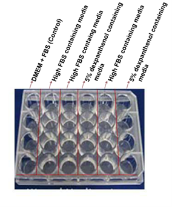

### Materials Required
1. 90% confluent monolayer of cells in a 24 well plate.
2. 10 microlitre micropipette tips.
3. PBS.
4. Culture Media.
5. Pipettes.
6. Inverted microscope.
7. Cell Culture media.
8. 5% dexpanthenol containing media.
9. Hight FBS containing media. 

&nbsp;

### Procedure

&nbsp;

1. Cells should be cultured to confluence or near (>90%) confluence in 24 well dish.
2. Prepare 10 ml of 5% dexpanthenol containing media along with 10ml of high FBS containing media.
3. Using a sterile 10 μl pipet tip, scratch three separate wounds through the cells moving perpendicular to the line drawn in the step above. See the figure for arraignment of the scratches.
4. Rinse the cells (very gently as sheets of the cells may lift off if you are not careful) with PBS and replace 8 wells with 1 ml  of 5% dexpanthenol containing media, 8 wells with High FBS containing media and 8 well with normal cell culture media in the order shown below.
5. Take a picture using phase contrast and 10X at 0 hours. Carefully label the pictures.
6. Take pictures at 2, 4 and 6 hours.

&nbsp;

### Difference Encountered in a Real Laboratory

In an actual laboratory setting, there are certain important steps that are not necessarily applicable in a virtual lab:

1. Before starting the experiment sterile the laminar air flow chamber using spirit.
2. Always disinfect your work area when you are finished.
